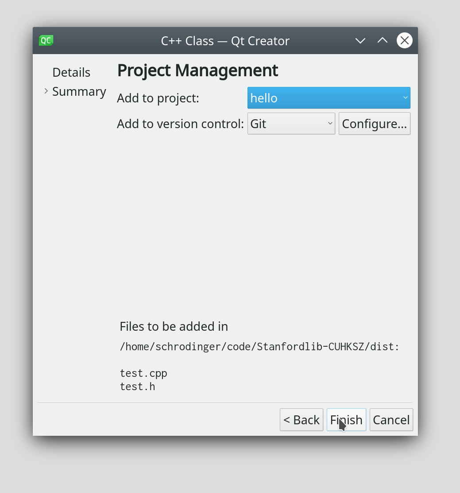

# Introduction

`StanfordLib-CUHKSZ` is a library based on the famous Stanford library with special patches for CUHK(SZ) Students. The design and development of this library is to provide some basic tools for CSE students learning C++ and developing basic programs.

The project is developed on GitHub and maintained actively by the Computer Comity of CUHK(SZ). Different from the original version, the library has migrated the distribution toolchain onto `cmake` as it is accepted by more IDEs and provides more opportunities for students to understand the compiling and linking mechanisms of C/C++ language.
Noticing that compiling the original version from sources may takes a lot of time, we decide to provide the pre-compiled versions together with the sources.

To apply more modern practices, reduce the difficulties of maintenance and improve the critical performance, we have also ported several famous libraries including `abseil-cpp` and `mimalloc` as the back-ends. This modification further provides some new features like memory statistics and tracing.

This Handbook will help the users setup the environment to import the library into their own projects. We hope that every student can get a lot of fun from programming\!

**Notice:** We currently not provide pre-compiled libraries with Windows MSVC tool-chains. This won’t affect the experience of CUHK(SZ) students as the recommended installation should use the GNU/Apple-LLVM
tool-chains in CSC3002. The source code is supposed to pass the compilation with MSVC but not tested. If you want to use the library with MSVC, please follow the instructions to compile the library from sources.

# Setup

## Requirements and Setups

### Versions

1.  Qt (>= 5.13)
2.  CMake (>= 3.14)

### Standard Qt Setup

For most systems including MacOS/Linux/Windows, the Qt bundled installer downloaded from [the official website](http://qt.io) or other mirrors should be just appropriate to setup the Qt environment for the users. For CUHK(SZ) students, this [TUNA mirror](https://mirrors.tuna.tsinghua.edu.cn/qt/official_releases/qt/5.14/5.14.0/%20) is a fast choice.

### Standard CMake Setup

CMake can be easily setup by the [official installers](https://cmake.org/download/). For Windows users, it is recommended to add CMake executable into the `%PATH%` variable (this setting can be done via GUI, please search for a proper tutorial if you have problem on it).

### MSYS2 Setup

For MSYS2 users on Windows, the `mingw-w64` toolchain is another available option. The Qt and CMake can be installed by the following commands:

``` bash
pacman -S --needed --noconfirm mingw-w64-x86_64-gcc mingw-w64-x86_64-cmake  mingw-w64-x86_64-qt5
```

### Linux Setup

For Linux users, the package manager in the corresponding distribution should be able to setup the environment directly. If you are using a self-configured installation, please make sure the environment variables (i.e. `$Qt5_DIR`) is set correctly.

### Homebrew Setup

It is tested that homebrew is able to setup CMake and Qt5 correctly.

``` bash
brew install qt cmake
```

If Qt is not working, the following environment variables can be considered:

``` yaml
LDFLAGS: "-L/usr/local/opt/qt/lib"
CPPFLAGS: "-I/usr/local/opt/qt/include"
Qt5Widgets_DIR: "/usr/local/opt/qt/lib/cmake/Qt5Widgets"
Qt5Test_DIR: "/usr/local/opt/qt/lib/cmake/Qt5Test"
Qt5Core_DIR: "/usr/local/opt/qt/lib/cmake/Qt5Core"
Qt5_DIR: "/usr/local/opt/qt/lib/cmake"
Qt5Concurrent_DIR: "/usr/local/opt/qt/lib/cmake/Qt5Concurrent"
Qt5Gui_DIR: "/usr/local/opt/qt/lib/cmake/Qt5Gui"
```

### CLion Setup

If you are using CLion, the bundled CMake is just okay to use. You should pay special attentions to Qt libraries and make sure that they are able to be found by CMake. Basically, adding ld options and PATH variables will solve most of the problems.

## Download the Pre-compiled Packages

If you want to use the pre-compiled packages, please follow the instructions bellow.

It is most recommended to download the [full version](https://github.com/SchrodingerZhu/StanfordLib-CUHKSZ/releases/download/2020.1/x86_64-full.zip) directly as it is supposed to pass the compilation on all popular platforms and your environment may vary from teachers’ environment when grading.

However, if you just want the libraries for specific platforms, you can download them from the following links:

1.  [`x86_64-darwin-clang`](https://github.com/SchrodingerZhu/StanfordLib-CUHKSZ/releases/download/2020.1/x86_64-darwin-clang.zip) (for MacOS)
    
2.  [`x86_64-linux-gcc`](https://github.com/SchrodingerZhu/StanfordLib-CUHKSZ/releases/download/2020.1/x86_64-linux-gcc.zip) (for Linux)
    
3.  [`x86_64-windows-mingw_w64`](https://github.com/SchrodingerZhu/StanfordLib-CUHKSZ/releases/download/2020.1/x86_64-windows-mingw_w64.zip) (for Windows)

## Download the Sources

If you want to use the sources, please follow the instructions bellow. You will need `git`. Please install it properly first.

Go to a right place and run:

``` bash
git clone https://github.com/SchrodingerZhu/StanfordLib-CUHKSZ
git submodule update --init --recursive
```

# Using Libraries or Sources

The following instructions works both for pre-compiled libraries and sources.

## With Qt Creator

Open Qt Creator and then click the Open Button.


Go to the correct directory and then open the `CMakeLists.txt`


Choose a correct tool-chain.


Click the Run Button and you should be able to get a smiling face :).


## With CLion

Open CLion and then click the Open Button.


Choose the directory that contains the `CMakeLists.txt`


Click the Run Button and you should be able to get a smiling face :).


## Self Compiling

Go to the directory and use CMake:

``` bash
mkdir build
cmake .. -DCMAKE_BUILD_TYPE=Release -G <your generator>
cmake --build . --parallel <number of jobs>
```

Where `<your generator>` and `<number of jobs>` must be set properly.

Typical generator is "MinGW Makefiles" on Windows and "UNIX Makefiles" on other platforms and other generators like "Ninja" should also work if you have the corresponding tools. On Windows, you may have to remove git-bash out of PATH temporarily if you run into an error with "sh".

# Structures of Pre-compiled Version

A typical pre-compiled version contains the following things:


1.  includes: the header files and essential definitions of the library.
2.  libs: pre-compiled libraries.
3.  res: the resources to be copies to the compiling output directory, you can add things here if you want to read files in relative paths.
4.  src: you should put your sources here.

# About CMakeLists.txt

CMake will read the commands from `CMakeLists.txt` and then compile the targets.

T.L.D.R., you will need to edit the executable target if you want to add/change files of your own projects.

For example, here we are adding `test.h` and `test.cpp` to the project, we placed them into the src directory and then editing the target definition to be

``` cmake
add_executable(hello src/hello.h src/hello.cpp src/test.cpp src/test.h)
```

CMake will resolve the new linking relations now.

Normally, IDEs will provide GUI tools for us to modify the definition automatically. For example, in CLion, right click on src directory and then click new and C++ Class/Header File/Source File, and check the "Add to targets". Then, the files will be created and the definition will be modified.


The operations are quite similar for Qt Creator:




# Tips

There are differences in the usage of the library from the original version. Here are the tips:

1.  We hope you can use a more elegant naming and organizing method. Hence instead of the original style like `#include "gfont.h"`, we adapt a modularized way : `#include <graphics/gfont.h>`
2.  The original Stanford library mixes files in all modules and produces cyclic dependency relations, therefore, we have to produce to whole shared library, instead of multiple small libraries for each module.
3.  The original version takes the advantage of `qmake` toolchain and make some renaming around main() function. Here, we want to separate the library and user’s code. Therefore, we do not use the library itself to do the renaming. Instead, users should write a entry function (say `start`) by themselves and include macro.h and call `__WRAP_MAIN__(start)` to invoke the library.
4.  The back-end of `Map` and `HashMap` has been migrated to `absl::btree_map` and `absl::flat_hash_map` to improve the performance.
5.  Vast functions in`strlib.h` has been refactored into wrappers around‘absl‘ to reduce the difficulty of maintenance.
6.  Char checking operation now uses `std::memchr` directly instead of self implementing.
7.  In most cases, you do not need to care about the changes: they do not require any manual interference on APIs.
8.  We also bind the library with [mimalloc](https://github.com/microsoft/mimalloc), it is more efficient and it can output some debug messages for you, please check [environment-options](https://github.com/microsoft/mimalloc#environment-options).
